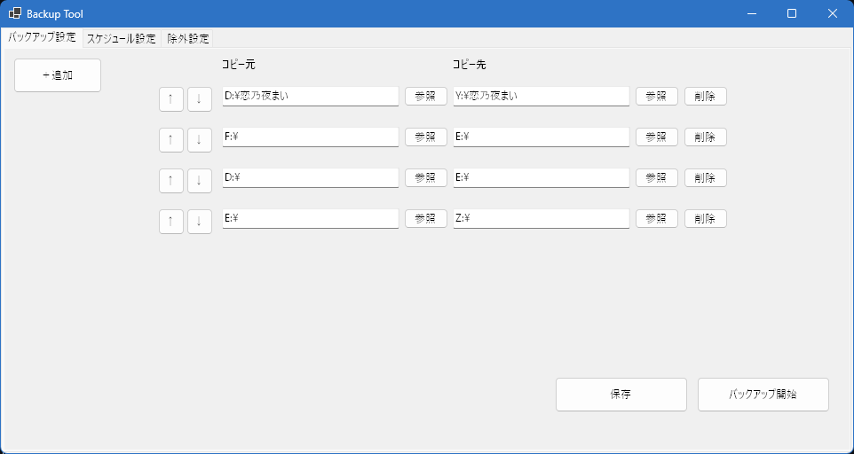
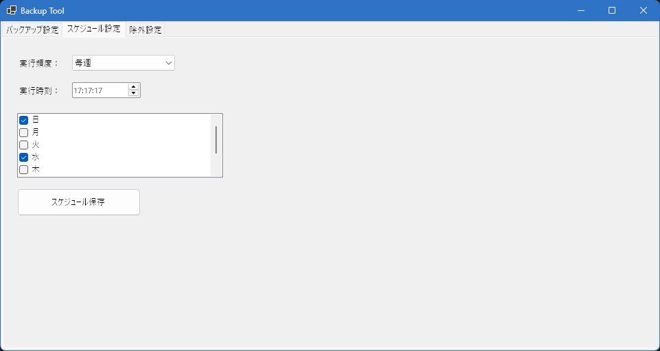
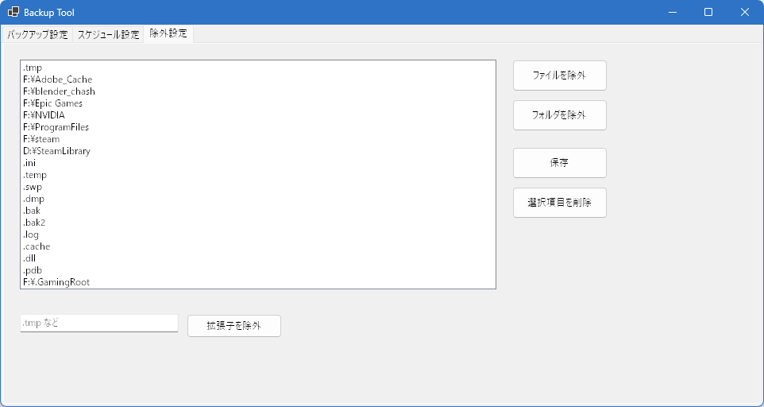

# FilesBackup

**Windows PC でフォルダを定期的にバックアップ**するためのソフトウェアです。

とにかく動くことを優先して作成しており、以下のような制約や問題が残っています。

- コピー元フォルダが存在しない場合に処理が止まることがある
- 宛先をコピー元の配下に設定すると無限ループ的にコピーしてしまう危険がある
- ジャンクション/シンボリックリンクを辿ってしまうため、意図しない範囲をコピーする可能性がある
- 設定ファイルの形式（除外設定など）は今後変更される可能性が高い
- タスクスケジューラで「最高特権」で実行されるため、誤設定するとシステムに影響を及ぼすリスクがある
- 大量のファイルを扱うと動作が重くなり、UIがフリーズする場合がある

したがって、**重要な環境での利用は推奨しません**。

## 🧩 機能

各種設定は実行ファイルからの相対パスで以下に保存されます:

- `./Config/backup_config.json`
- `./Config/schedule_config.json`
- `./Config/ignore_config.json`

---

### 1. バックアップ設定

- **追加** ボタンで設定枠を増やせます。
- **参照** ボタンでフォルダを選択、またはコピー元とコピー先を直接入力できます。
- **↑↓** ボタンで順序を変更（上から順に実行）。
- **保存** ボタンで設定を保存します。
- **バックアップ開始** ボタンで即時バックアップを実行します。

---

### 2. スケジュール設定

- バックアップ頻度を設定できます。
- **スケジュール保存** ボタンを押すと、Windows **タスクスケジューラ**に登録されます。

---

### 3. 除外設定

- 特定の **ファイル** または **フォルダ** を除外可能。
- 下の入力欄に `.tmp` などを記入することで拡張子単位の除外も可能です。

---

## 📦 インストール方法

1. [Releases ページ](https://github.com/gonzaresu-jp/FilesBackup/releases/tag/Backup) から **Latest** バージョンを開く  
2. `FilesBackup.zip` をダウンロード  
3. 任意の場所に解凍して、フォルダ内の `.exe` を実行  

---

## ❌ アンインストール方法

1. インストールしたフォルダを削除  
2. Windows タスクスケジューラ内の **FilesBackup** を削除  

---

## 🗺️ 今後の改善点

### 0. 直近（安定性・安全性の底上げ）
- [ ] **存在しないコピー元はスキップ**し、処理継続（ログに `[SKIP]` を残す）
  - *AC*: 存在しないフォルダが1件あっても他タスクは完走する
- [ ] **自己配下コピーのブロック**（`dst` が `src` のサブディレクトリなら実行前に停止）
  - *AC*: UI上で保存時/実行時に警告→実行不可
- [ ] **ジャンクション/シンボリックリンクは既定で辿らない**
  - *AC*: 再解析ポイント検知でスキップ、オプションで有効化可能
- [ ] **UI非同期実行**（バックアップを別スレッド/Taskで実行、UIフリーズ防止）
  - *AC*: 実行中でもボタンやタブ切替が応答する、キャンセル可能
- [ ] **例外ハンドリング拡充**（`DirectoryNotFoundException/IOException/PathTooLongException` 等）
  - *AC*: 例外でアプリが落ちない。ログに原因と対象パスを出力

### 1. セキュリティ/権限
- [ ] **スケジューラ権限のオプション化**（既定=標準権限、必要時のみ「最高特権」）
- [ ] **設定保存先の見直し**（ユーザー単位 `%LocalAppData%` / 管理者運用時は `%ProgramData%`）
- [ ] **Named Pipe の入力検証**（“SHOW”以外破棄、将来拡張時は呼出元SID検証）
- [ ] **書き込み先ホワイトリスト/ブラックリスト**（誤設定での上位ディレクトリ破壊を防止）

### 2. パフォーマンス/大規模対応
- [ ] **並列コピー**（I/O負荷を見て `MaxDegreeOfParallelism` 自動調整）
- [ ] **タイムスタンプ比較の許容誤差**（例：±2 秒）でNAS/FATの差異を吸収
- [ ] **大規模ログのローテーション**（`%LOCALAPPDATA%\FilesBackup\logs\YYYYMMDD.log`）
- [ ] **差分判定の強化（任意）**：サイズ+時刻に加え、必要に応じてハッシュ比較を選択可

### 3. フィルタ/除外設定
- [ ] **拡張子とパスの分離スキーマ**（`Extensions` と `Paths` をJSONで独立管理）
- [ ] **ワイルドカード/グロブ**対応（`**/Cache/**`, `*.tmp` 等）
- [ ] **隠し/システム属性スキップ**をオプション化

### 4. スケジューリング/運用
- [ ] **ミスした実行の補填**（PCスリープ等で逃した場合に起動直後すぐ実行）
- [ ] **AC電源時のみ/スリープ解除して実行**などの条件指定
- [ ] **リトライ/バックオフ**ポリシー（失敗時の再試行回数と間隔）
- [ ] **実行履歴ビュー**（最終実行時刻/所要時間/変更件数を一覧表示）

### 5. UX/使い勝手
- [ ] **プレビュー（ドライラン）**：コピー対象と件数だけ出す
- [ ] **進捗バー/残り推定時間/現在ファイル**の表示
- [ ] **キャンセル/一時停止/再開**
- [ ] **事前検証ウィザード**（`dst` が `src` 配下、書込み不可、容量不足等を事前チェック）
- [ ] **設定のインポート/エクスポート**（JSONスキーマの明記）
