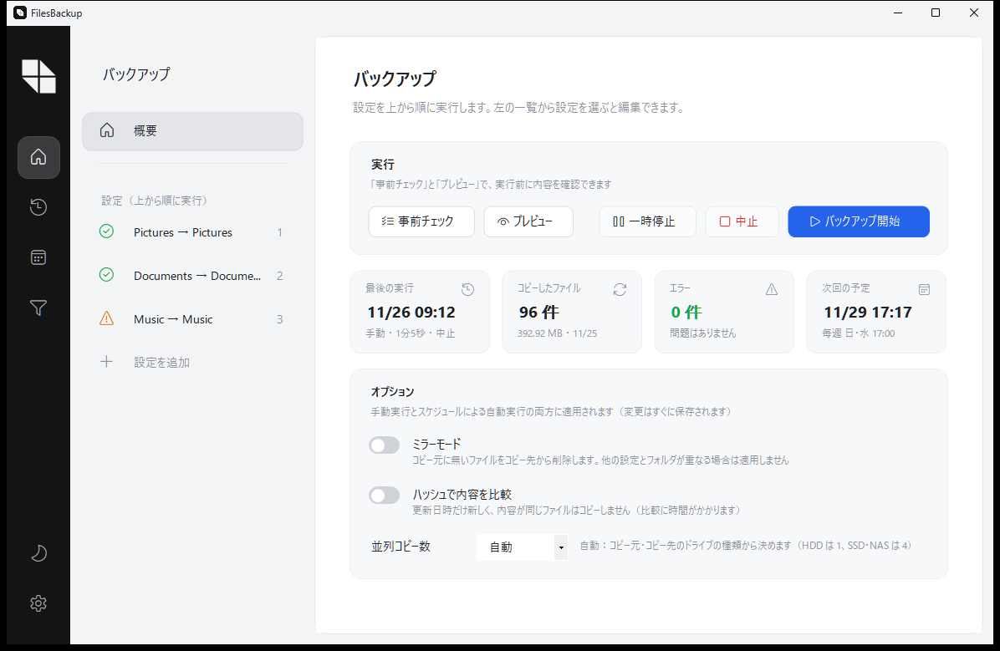
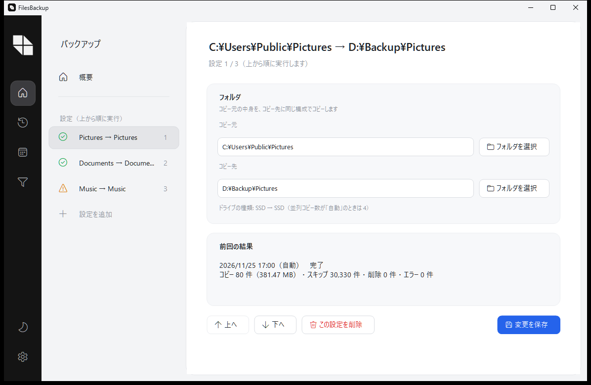
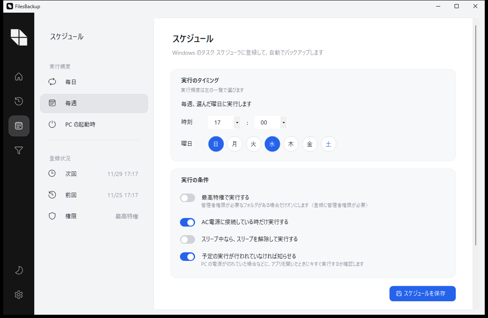
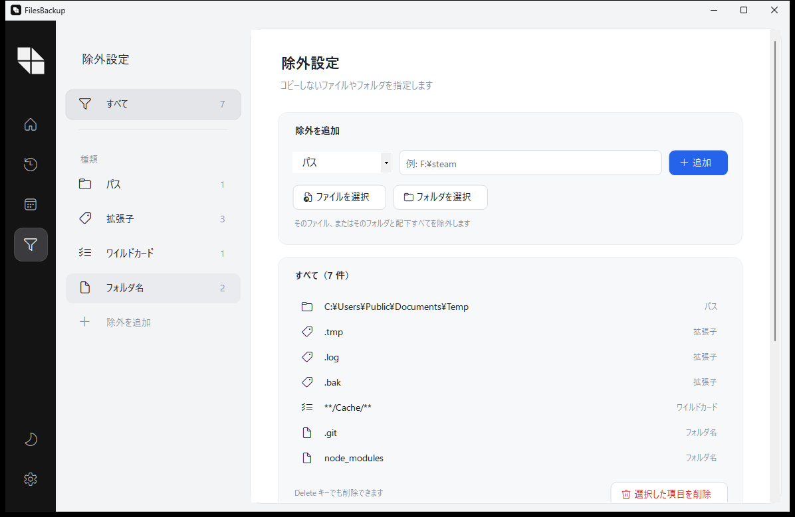
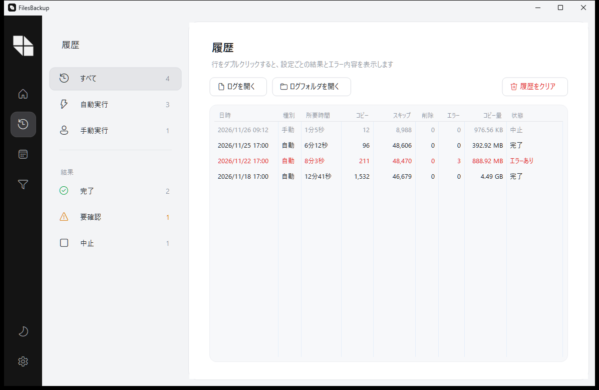
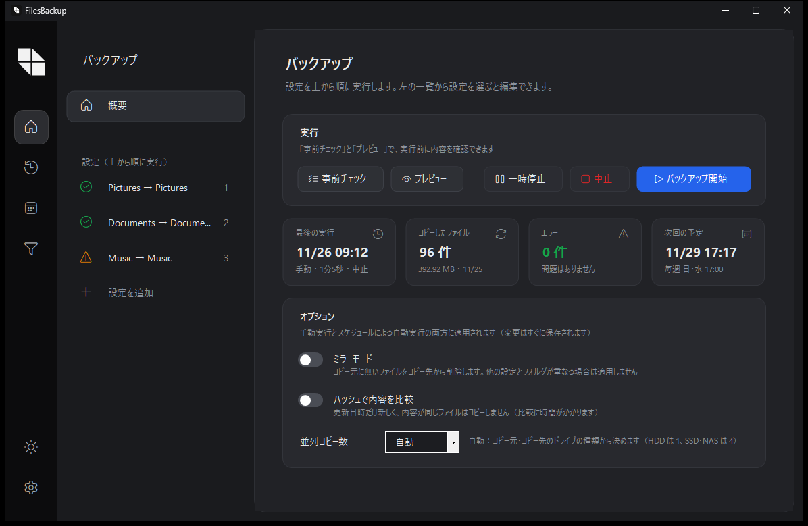

# FilesBackup

**Windows PC でフォルダを定期的にバックアップ**するためのソフトウェアです。

コピー元からコピー先へ、新しいファイル・更新されたファイルだけをコピーします（差分コピー）。
Windows のタスク スケジューラに登録して、毎日・毎週・起動時に自動で実行できます。

> ⚠️ 個人用に作っているソフトウェアです。大切なデータの唯一のバックアップ手段にはせず、
> 「事前チェック」と「プレビュー」で動作を確認してから使ってください。
> 特に **ミラーモード** はコピー先のファイルを削除します。

## 🧩 機能

画面は、左端のアイコンでページを切り替え、2列目の一覧で項目を選び、右側で内容を確認・編集する構成です。
ライトモードとダークモードがあります（左下のボタンで切り替え。起動時は Windows の設定に合わせます）。

### 1. バックアップ



- 2列目に設定が **上から実行する順** に並びます。アイコンは前回の結果（完了・要確認・未実行）です。
- **事前チェック**：コピー元の有無、コピー先への書き込み可否、ドライブの有無、危険な設定を確認します。
- **プレビュー**：実際にはコピーせず、コピー・削除される件数と容量、コピー先の空き容量を表示します。
- **バックアップ開始**：実行中もウィンドウは操作でき、**一時停止／再開／中止** ができます。
  進捗（確認済み件数・コピー済み件数と容量・処理中のファイル・この設定の残り時間の目安）を表示します。
- 最後の実行、コピーしたファイル、エラー、次回の予定をひと目で確認できます。
- **ミラーモード**：コピー元に無いファイルをコピー先から削除します（後述の安全策あり）。
- **並列コピー数**：「自動」はコピー元・コピー先のドライブの種類から決めます（HDD は 1、SSD・NAS は 4）。
- **ハッシュで内容を比較**：更新日時だけ新しく内容が同じファイルはコピーしません。



- 一覧の設定を選ぶと、コピー元・コピー先の変更、順序の入れ替え、削除ができます。
- 危険な設定（コピー先がコピー元の配下など）やコピー元が見つからない場合は、その場で表示します。

### 2. スケジュール設定



- 実行頻度（毎日・毎週・起動時）と時刻を設定し、**スケジュールを保存** でタスク スケジューラに登録します。
- **最高特権で実行**（既定はオフ）、**AC電源時のみ実行**、**スリープを解除して実行** を選べます。
- 予定時刻に PC が起動していなかった場合は、起動後すぐに実行されます。
  さらに、予定の実行が行われていないことをアプリを開いたときに知らせ、その場で実行できます。
- 自動実行が異常終了した場合は、15 分おきに最大 3 回再試行します。
- 登録状況（次回・前回の実行、権限）と最後のバックアップ結果を表示します。

### 3. 除外設定



| 種類 | 例 | 意味 |
| --- | --- | --- |
| パス | `F:\steam` | そのファイル、またはそのフォルダと配下すべて |
| 拡張子 | `.tmp` | その拡張子のファイル |
| ワイルドカード | `**/Cache/**`、`F:\work\*.bak` | `*` は区切り内、`**` はフォルダをまたぐ、`?` は1文字 |
| フォルダ名 | `.git`、`node_modules` | どこにあっても、その名前のフォルダ |

- **隠し/システム属性のファイル・フォルダを除外**（任意）。
- **ジャンクション/シンボリックリンクは既定で辿りません**（任意で辿ることも可能）。
- 各ドライブ直下の `System Volume Information`、`$RECYCLE.BIN`、`pagefile.sys`、`hiberfil.sys`、`swapfile.sys` は常に除外します。

### 4. 履歴



- 実行日時・種別（自動／手動）・所要時間・コピー／スキップ／削除／エラー件数・コピー量・状態を一覧表示します。
  2列目で、自動／手動や、完了／要確認／中止に絞り込めます。
- 行をダブルクリックすると、設定ごとの結果とエラー内容を表示します。
- NAS などで使えない名前（長すぎる名前・使えない文字）のファイルは、他のエラーと分けて件数を表示します。
- ログ（`%LocalAppData%\FilesBackup\Logs\backup_YYYY-MM-DD.log`）は 30 日で自動削除します。
  同じ原因のエラーが大量に出た場合、ログには先頭 200 件だけ詳細を書きます（件数は集計します）。

### 5. 設定

- 保存先を開く、**設定のインポート/エクスポート**、**管理者として再起動**、**管理者運用モード** の切り替えができます。

### 6. タスクトレイに常駐

- **Windows のサインイン時に起動して、タスクトレイに常駐** します（ウィンドウは出しません。「設定」→「一般」でオフにできます）。
- ウィンドウを閉じたり最小化したりしても終了せず、トレイに残ります。トレイのアイコンをクリックすると開きます。
- トレイのメニューから **今すぐバックアップ／中止／更新を確認／終了** ができます。
- 予定のバックアップが実行されていなかった場合や、新しいバージョンが出た場合は、トレイの通知で知らせます。

### 7. 自動アップデート

- 1日1回、GitHub の最新リリースを確認します（「設定」→「アップデート」で手動確認・オフも可能）。
- 新しいバージョンがあるとトレイの通知と画面でお知らせし、**「更新する」を押すとダウンロードからインストール、起動し直しまで自動** で行います。
  - ダウンロードしたファイルは SHA-256 で検証してから使います（取得先は GitHub の HTTPS のみ）。
  - 更新前のバージョンは `%LocalAppData%\FilesBackup\InstallBackup` に保存します。設定・履歴はそのまま引き継ぎます。
  - `C:\Program Files` のように書き込みに管理者権限が必要な場所にインストールしている場合は、更新のたびに UAC の確認が1回表示されます。
  - バックアップの実行中（自動実行を含む）は更新しません。



## 🛡️ 安全のための動作

- **コピー元が見つからない設定はスキップ**し、他の設定は最後まで実行します。
- **コピー先がコピー元の配下**（無限にコピーが続く）、**システムドライブ直下・Windows・Program Files** への設定は保存・実行できません。
- **空き容量の確認**は、実際にコピーが必要な量（差分）で行います。足りなければその設定を中断して記録します。
- **ミラーモード** は次の場合は削除を行いません。
  - コピー先が、他の設定のコピー元・コピー先や自分のコピー元と重なっている
  - 削除しようとするファイルが除外設定に一致する、またはリンク（ジャンクション）である
  - コピー元のフォルダが読み取れなかった、コピー元が空だった（ドライブの接続間違いの可能性）
  - コピーが容量不足や中止で最後まで終わらなかった
- 自動実行と手動実行は同時には動きません。

## ⚙️ 設定ファイル

`%LocalAppData%\FilesBackup\Config` に保存します（以前のバージョンは exe と同じフォルダの `Config` に保存していました。初回起動時に自動でコピーし、旧ファイルは残します）。

**管理者運用モード**（「設定」→「保存先」）にすると、全ユーザー共通の `%ProgramData%\FilesBackup` に保存します。
設定の変更には管理者権限が必要になり、ログと履歴は標準権限の自動実行からも書き込めるようにします。
切り替えには管理者権限が必要で、切り替え後にアプリを再起動します。

| ファイル | 内容 |
| --- | --- |
| `backup_config.json` | バックアップ設定（コピー元・コピー先の一覧） |
| `ignore_config.json` | 除外設定（`Paths`・`Extensions`・`Patterns`・`FolderNames`） |
| `schedule_config.json` | スケジュール設定 |
| `options_config.json` | ミラーモード・並列数・ハッシュ比較・隠しファイル・リンクの設定 |

### インポート/エクスポートの形式

「設定」→「設定をエクスポート」で、すべての設定を1つの JSON にまとめます。

```jsonc
{
  "SchemaVersion": 1,                       // 形式のバージョン（現在 1）
  "ExportedAt": "2026-11-26T22:00:00+09:00",
  "AppVersion": "2.0.0.0",
  "Tasks": [                                // 上から順に実行
    { "Source": "E:\\", "Destination": "Z:\\" }
  ],
  "Ignore": {
    "Paths": ["F:\\steam"],                 // 絶対パス
    "Extensions": [".tmp", ".log"],         // 拡張子
    "Patterns": ["**/Cache/**"],            // ワイルドカード
    "FolderNames": [".git"]                 // フォルダ名
  },
  "Schedule": {                             // 省略可（省略時は現在のスケジュールのまま）
    "Frequency": "毎週",                    // 毎日 / 毎週 / 起動時
    "Time": "17:17:00",
    "DaysOfWeek": [0, 3],                   // 0=日曜 … 6=土曜（毎週のとき）
    "RunWithHighestPrivileges": false,
    "AcPowerOnly": true,
    "WakeToRun": false,
    "NotifyMissedRuns": true
  },
  "Options": {
    "MirrorMode": false,
    "SkipHiddenAndSystem": false,
    "FollowReparsePoints": false,
    "CompareByHash": false,
    "MaxDegreeOfParallelism": 0             // 0 = 自動、1〜8 = 固定
  }
}
```

インポート時は形式のバージョンと危険な設定（コピー先がコピー元の配下など）を確認してから上書きします。

## 📦 インストール方法

1. [Releases ページ](https://github.com/gonzaresu-jp/FilesBackup/releases/tag/Backup) から **Latest** バージョンを開く
2. `FilesBackup.zip` をダウンロード
3. 任意の場所に解凍して、フォルダ内の `.exe` を実行

[.NET 8 デスクトップ ランタイム](https://dotnet.microsoft.com/download/dotnet/8.0) が必要です。
通常は管理者権限なしで動きます。管理者権限が必要なフォルダをバックアップする場合は「設定」→「管理者として再起動」を使ってください。

## ❌ アンインストール方法

1. 「設定」→「一般」で「サインイン時に起動」をオフにし、トレイのメニューから終了
2. インストールしたフォルダを削除
3. Windows タスク スケジューラ内の **FilesBackupAutoTask** を削除
4. 設定・ログ・履歴も消す場合は `%LocalAppData%\FilesBackup` を削除

## 🛠️ ビルドと動作確認

```powershell
dotnet build FilesBackup.csproj -c Release
```

```powershell
dotnet run --project tests/EngineTests -c Release
```

`tests/EngineTests` はバックアップエンジンの動作確認です（差分コピー、除外、ミラーの安全策、中止・一時停止、設定の移行など）。
設定・ログ・履歴は一時フォルダに書き込むため、実際の環境には影響しません。

README の画面写真は、サンプルの設定を入れたフォルダを `FILESBACKUP_DATA_DIR` に指定し、
`FilesBackup.exe --screenshots <保存先フォルダ>` で作れます（各ページを画像に保存して終了します）。

アプリのアイコン（`Assets\app.ico`）は、画面のロゴと同じ図形から作っています。作り直すときは次のように実行します。

```powershell
.\bin\Release\Release\net8.0-windows\FilesBackup.exe --make-icon Assets\app.ico
```

## 🚀 リリースの公開（自動アップデートの配信）

`FilesBackup.csproj` の `Version` を上げてコミットし、同じ番号のタグを push すると、
GitHub Actions（`.github/workflows/release.yml`）がテスト・ビルドを行い、
`FilesBackup.zip` と `FilesBackup.zip.sha256` を GitHub Releases に公開します。
インストール済みのアプリは、このリリースを見つけて自動アップデートします。

```powershell
git tag v2.1.0
```

```powershell
git push origin v2.1.0
```

タグは `v` + バージョン番号（例: `v2.1.0`）にしてください。それ以外のタグやプレリリースは、自動アップデートの対象になりません。

## 🗺️ 今後の改善点

### 0. 直近（安定性・安全性の底上げ）
- [x] **存在しないコピー元はスキップ**し、処理継続
- [x] **自己配下コピーのブロック**（保存時・実行時に警告し実行不可）
- [x] **ジャンクション/シンボリックリンクは既定で辿らない**（オプションで有効化可能）
- [x] **UI非同期実行**（実行中も操作でき、中止可能）
- [x] **例外ハンドリング拡充**（読み取れないフォルダ・パスの問題でアプリが落ちない。ログに原因と対象パスを出力）

### 1. セキュリティ/権限
- [x] **スケジューラ権限のオプション化**（既定=標準権限、必要時のみ「最高特権」。以前の設定は最高特権のまま引き継ぎ）
- [x] **設定保存先の見直し**（ユーザー単位 `%LocalAppData%`、旧保存先から自動移行）
- [x] **管理者運用モード**（全ユーザー共通の `%ProgramData%` に保存）
- [x] **Named Pipe の入力検証**（同じユーザーのみ接続可、"SHOW" 以外は破棄）
- [x] **書き込み先ブラックリスト**（システムドライブ直下・Windows・Program Files）

### 2. パフォーマンス/大規模対応
- [x] **並列コピー**（「自動」はドライブの種類から決定：HDD は 1、SSD・NAS は 4。手動で 1〜8 も指定可）
- [x] **長いパス**（260 文字を超えるパスに対応。Windows の「長いパス」設定が有効な場合）
- [x] **タイムスタンプ比較の許容誤差**（±2 秒）
- [x] **ログのローテーション**（30 日で自動削除）
- [x] **差分判定の強化**：ハッシュ比較を選択可
- [x] **走査の効率化**：コピー元・コピー先をフォルダ単位で 1 回ずつ読む（以前はドライブ全体を 3 回走査していた）

### 3. フィルタ/除外設定
- [x] **拡張子とパスの分離スキーマ**（`Paths`・`Extensions`・`Patterns`・`FolderNames`）
- [x] **ワイルドカード/グロブ**対応
- [x] **隠し/システム属性スキップ**をオプション化

### 4. スケジューリング/運用
- [x] **ミスした実行の補填**（タスク スケジューラでの即時実行＋アプリを開いたときの通知）
- [x] **AC電源時のみ/スリープ解除して実行**
- [x] **リトライ/バックオフ**（ファイル単位で最大 3 回、自動実行の失敗時は 15 分おきに最大 3 回）
- [x] **実行履歴ビュー**（詳細表示付き）

### 5. UX/使い勝手
- [x] **プレビュー（ドライラン）**
- [x] **進捗バー/現在ファイル/残り時間の目安**の表示（残り時間は前回の件数をもとにした、実行中の設定ごとの目安）
- [x] **画面の刷新**（アイコンバー・一覧・カードで構成した新しいデザイン、ライト/ダーク）
- [x] **タスクトレイ常駐**（サインイン時に起動、通知、トレイメニュー）
- [x] **自動アップデート**（GitHub Releases から取得・検証・インストール）
- [x] **キャンセル/一時停止/再開**
- [x] **事前チェック**（`dst` が `src` 配下、書込み不可、ドライブなし等）
- [x] **設定のインポート/エクスポート**（JSON スキーマを上に記載）
